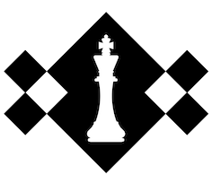

<h1 align="center">
Castle Chess - Tournament Manager
<br/>
</h1>

<h2>Introduction</h2>
Manage a chess tournament efficiently with this standalone offline program. It uses the Python3 language and runs on the console.

## Installation
To use this program, clone this project and run it through the console:
```bash
$ python3 main.py
```
Make sure to comply with the [package requirements](#package-requirements).

## What you can do with this program
In this application, you can:
- Create a new tournament
> 🔀 You can run multiple tournaments simultaneously!
- Manage a tournament:
  - Edit the tournament information
  - Add and Remove players to/from the tournament
  - Start a round
  > 🏁 See all the pairings for this new round!
  - End a round
  > 📝 Input all the results for the round into the system
  - See all ended and ongoing rounds, with all matches and results
- Add new players in the system
- Edit players, including their ranking
> 💾 All edits to a player will affect the tournaments they participate in
- Reports are available to show:
  - All players in the system by alphabetical or ranking order
  - All tournaments, including:
    - Tournament information
    - Tournament players by alphabetical or ranking order
    - All rounds executed during the tournament, with all matches and results

## Package requirements
Before using the application, please install all the packages as stated in [requirements.txt](requirements.txt)

From the terminal, use the command:

```bash
$ pip install -r requirements.txt
```

## Flake8 HTML Report
We thrive on writing clear and maintainable code. 
We follow Pep8 styling guidelines and flake8 to help us ensure we comply with these recommendations.

You can find our current flake8-html report here: [flake8_report repository](/flake8_report).

You can order a new flake8-html report from the console:
```bash
$ flake8 --format=html --htmldir=flake8_report
```

